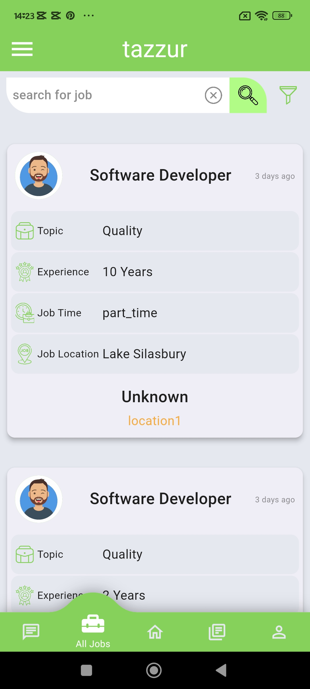

# Tazur-User-App-
The Taazur User App is designed to provide job seekers with a comprehensive platform to manage their career growth. Users can register with detailed information about their job history, education, and career. The app allows users to browse and apply for job opportunities, enroll in courses, seek professional consultations, follow companies.

## Features
- **User Registration:** Complete profile with job, education, and career details.
- **Job Opportunities:** Browse and apply for available job listings.
- **Courses:** View and enroll in various courses.
- **Consultations:** Apply for consultations with professional advisors.
- **Company Profiles:** Follow companies and stay updated with their latest news.
- **Surveys:** Participate in surveys to provide feedback and opinions.
- **Multi Languages:** Create the app with two languages (English & Arabic).

## Technologies Used
- **Flutter:** For building the mobile app.
- **RESTful APIs:** For server-side interactions.
- **Dart:** The programming language used for Flutter.
- **Get State Managment**

  
  
  

  
  
  

  
  
  

  
  
  

  
  

  
  
  

  
  

